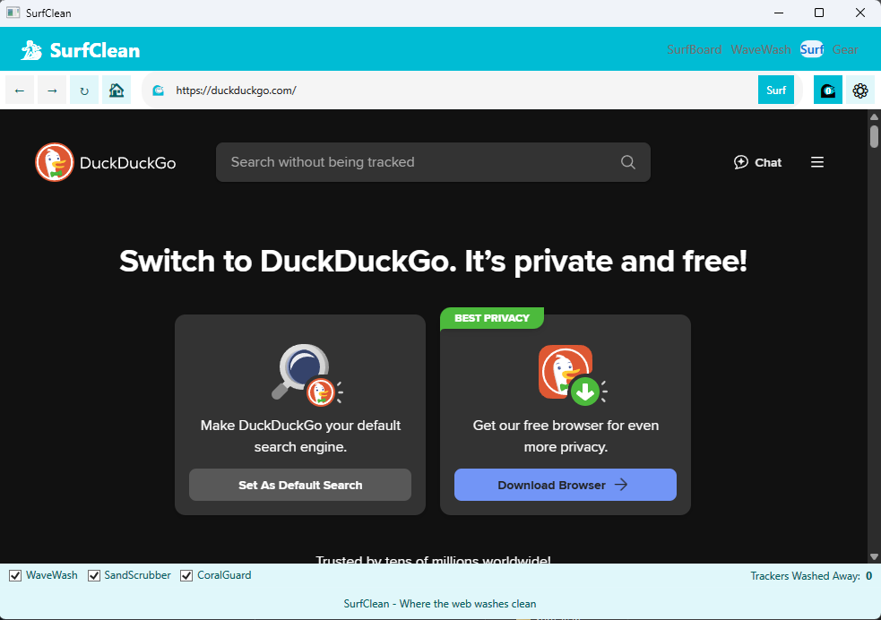

# SurfClean

A privacy-focused Windows desktop application that washes away tracking as you browse the web, built with .NET 8 and WPF.



## Overview

SurfClean is a demonstration application that provides a cleaner, more private browsing experience. Just as waves wash away footprints on a beach, SurfClean removes tracking attempts and digital fingerprints as you navigate the web.

The application includes:

1. **WaveWash Scanner** - Detects and washes away tracking elements from your system
2. **Clean Surf Browser** - A WebView2-based browser with active tracking prevention
3. **SurfBoard** - Visual dashboard showing your privacy status and cleaning statistics
4. **Surf Gear** - Configure your privacy protection settings

## Features

### WaveWash Scanner
- Detects tracking elements that can compromise your privacy
- Categorizes trackers by type and risk level
- Provides actions to clean or block tracking elements

### Clean Surf Browser
- Built on WebView2 (Chromium-based)
- Actively blocks tracking requests before they load
- Prevents fingerprinting and third-party cookies
- Shows real-time tracker washing statistics
- Clean, intuitive interface with ocean-inspired design

### Key Privacy Features
- **WaveWash:** Blocks and removes tracking attempts in real-time
- **SandScrubber:** Cleans cookies and prevents cross-site tracking
- **CoralGuard:** Protects against browser fingerprinting techniques
- **TideSignal:** Communicates privacy preferences to websites

## Technical Implementation
- **MVVM Architecture** - Clean separation of concerns
- **Reactive UI** - Event-driven programming model
- **WebView2 Integration** - Modern browser component with privacy enhancements
- **Ocean-Themed UI** - Light, refreshing design with ocean color palette

## Getting Started

### Prerequisites
- Windows 10 (May 2020 Update) or newer
- .NET 8.0 SDK
- Visual Studio 2022 or newer (recommended)

### Installation

1. Clone the repository:
```
git clone https://github.com/konradwalsh/surfclean.git
```

2. Open the solution in Visual Studio or build from command line:
```
cd surfclean
dotnet build
```

3. Run the application:
```
dotnet run
```

## Development Notes

This application is a demonstration of concepts and not intended for production use. Key design considerations:

- **Clean Surf Approach**: All privacy features are enabled by default for the cleanest possible browsing
- **Local Processing**: No data is sent to remote servers
- **MVVM Pattern**: ViewModels handle business logic with minimal code-behind
- **WebView2 Customization**: Browser component configured for enhanced privacy protection

## WebView2 Privacy Enhancements

The browser component demonstrates several privacy enhancements for clean browsing:

1. **Resource Filtering**: Blocks requests to known tracking domains
2. **Cookie Management**: Blocks third-party cookies
3. **Fingerprint Protection**: Modifies browser characteristics to prevent identification
4. **Navigation Privacy**: Controls redirects and new window requests

## Future Enhancements

In a complete implementation, these features would be added:

- Tide tracking visualization showing tracking attempts over time
- Surf history management with automatic cleaning options
- Wave pattern recognition for identifying new trackers
- Beach patrol mode for maximum protection during sensitive browsing
- Synchronized cleaning across multiple devices with encrypted sync

## License

This project is licensed under the MIT License - see the LICENSE file for details.

## Acknowledgments

- Inspired by the need for cleaner web browsing
- WebView2 component developed by Microsoft
- Privacy tracking data based on open-source tracker lists
- Created as a demonstration for DuckDuckGo's Windows browser development team
